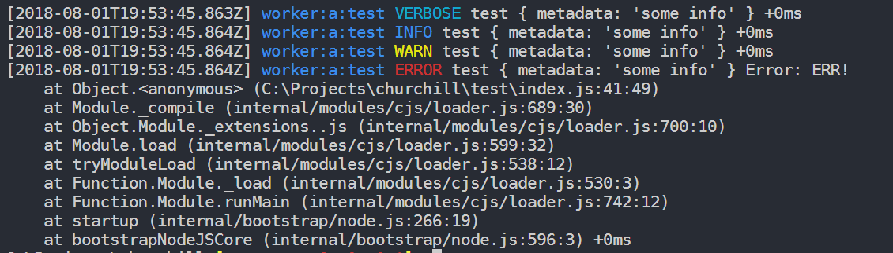

# Churchill (Work in Progress)

Node logging utility.

## Features

1. Namespaces
1. Time tracking (elapsed ms from last log)
1. Logging levels
1. Hide namespaces based on env. variable
1. Hide log levels based on env. variable
1. Handle any type of variable
1. Custom formatting

## Usage

```js
const chalk = require("chalk");
const util = require("util");

process.env.CHURCHILL_DEBUG = "worker:a:*"; // Log only namespaces matching worker:a:*
process.env.CHURCHILL_DEBUG_LEVEL = "debug"; // Log only verbose and above

const churchill = require("churchill");

const colors = {
  error: "red",
  warn: "yellow",
  info: "blue",
  verbose: "cyan",
  debug: "green",
  silly: "gray"
};

// Colorize the log level
const colorizeLevel = level => chalk[colors[level.toLowerCase()]](level);

// Setup the logger - returns a createLogger function
const createLogger = churchill({
  transports: [new churchill.Console({ level: "verbose" })], // Transports - must have a log() function
  // Custom formatter function
  format: info => {
    const { namespace, level, timestamp, ms, args } = info;

    return `[${timestamp.toISOString()}] ${chalk.blue(namespace)} ${colorizeLevel(level.toUpperCase())} ${util.format(...args)} +${ms}ms\n`
  }
});

const logger = createLogger("worker:a:test"); // namespace

logger.silly("test", { metadata: 'some info' });
// Not logged - CHURCHILL_DEBUG_LEVEL is set to 'debug'
logger.debug("test", { metadata: 'some info' });
// Not logged - transport Console is set to 'verbose'
logger.verbose("test", { metadata: 'some info' });
// [2018-08-01T19:46:47.582Z] namespace:test VERBOSE test { metadata: 'some info' } +0ms
logger.info("test", { metadata: 'some info' });
// [2018-08-01T19:46:47.582Z] namespace:test INFO test { metadata: 'some info' } +0ms
logger.warn("test", { metadata: 'some info' });
// [2018-08-01T19:46:47.582Z] namespace:test WARN test { metadata: 'some info' } +0ms
logger.error("test", { metadata: 'some info' }, new Error("ERR!"));
// [2018-08-01T19:46:47.582Z] namespace:test ERROR test { metadata: 'some info' } Error: ERR!
//     at Object.<anonymous> (C:\Projects\churchill\test\index.js:37:32)
//     at Module._compile (internal/modules/cjs/loader.js:689:30)
//     at Object.Module._extensions..js (internal/modules/cjs/loader.js:700:10)
//     at Module.load (internal/modules/cjs/loader.js:599:32)
//     at tryModuleLoad (internal/modules/cjs/loader.js:538:12)
//     at Function.Module._load (internal/modules/cjs/loader.js:530:3)
//     at Function.Module.runMain (internal/modules/cjs/loader.js:742:12)
//     at startup (internal/bootstrap/node.js:266:19)
//     at bootstrapNodeJSCore (internal/bootstrap/node.js:596:3) +0ms
```

This is how it can look like in a terminal:


