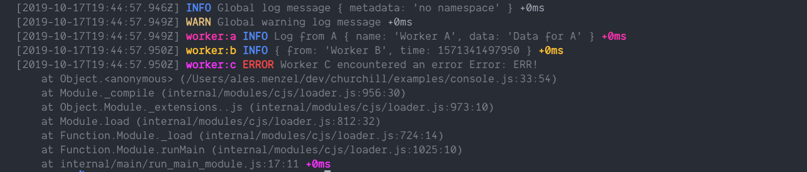

# Console transport

Log to a terminal. Uses chalk to colorize the output. By setting the `errorLevel` you can change which levels are logged to the standard error (stderr) instead of standard output (stdout). Usually best for local development.



```bash
npm install @churchill/console
```

## Usage

```js
const churchill = require("@churchill/core");
const Console = require("@churchill/console");

const consoleTransport = Console.create()
consoleTransport.on("error", (err) => {
  // ... you should handle errors
});

const createNamespace = churchill({
  transports: [consoleTransport]
});

const logger = createNamespace("worker:1");
logger.info("...");
```

## Options

| Name         | Description                           | Example                                  |
| ------------ | ------------------------------------- | ---------------------------------------- |
| `errorLevel` | Max log level to stream to stderr     | `{ errorLevel: "error" }`                |
| `format`     | Custom formatting function.           | `{ format: (info, out, logger) => ... }` |
| `maxLevel`   | Max level to log into this transport. | `{ maxLevel: "warn" }`                   |

## Events

| Name    | Params               | Description                                                                   |
| ------- | -------------------- | ----------------------------------------------------------------------------- |
| `error` | `error: Error`       | Emited when you encounter backpreassure for the output stream (stdout/stderr) |
| `drain` | `streamName: string` | When a stream is able to accept new messages                                  |
